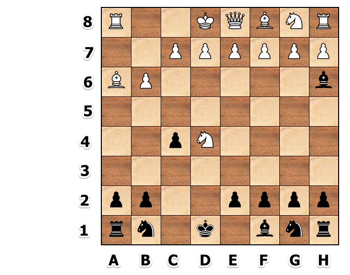

*Note*: I'm using standard chess notation to describe the action at a high level.  You will use your standard x/y 0-7 notation. Below is not valid code, but merely used to communicate the idea.

```
is_obstructed? A6 -> C4 => false
is_obstructed? F1 -> D3 => true
is_obstructed? A1 -> A4 => true
is_obstructed? D4 -> B5 => Raise an Error Message # invalid input.  Not diagnal, horizontal, or vertical.
is_obstructed? A8 -> A6 => false # note: this is not an obstruction.  This has a piece in the destination, but not in between the pieces.
is_obstructed? A8 -> C8 => false
```